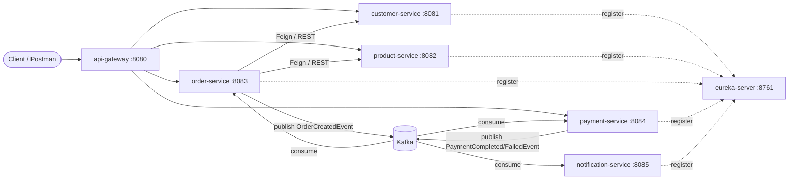

# Java 21 + Spring Boot Microservices — Order Management Training

A complete, hands-on training course for **Beginner → Intermediate → Advanced**
Java engineers, built around one running example: an **Order Management System**
made of real Spring Boot microservices.

Every lesson in [`docs/`](docs/) points at real, working, tested code in
[`order-management-system/`](order-management-system/). Nothing here is
pseudo-code — clone it, run it, break it, fix it.

## Course map

| Level | Folder | Focus |
|---|---|---|
| Beginner | [docs/beginner](docs/beginner) | Spring Boot fundamentals, REST, JPA, validation, testing — built with `customer-service` and `product-service` |
| Intermediate | [docs/intermediate](docs/intermediate) | Microservices architecture, service discovery, API gateway, OpenFeign, Resilience4j, OpenAPI/Swagger docs — built with `eureka-server`, `api-gateway`, `order-service` |
| Advanced | [docs/advanced](docs/advanced) | Event-driven architecture with Kafka, the Saga pattern, JWT security, observability, Docker/Kubernetes, Testcontainers — built with `payment-service`, `notification-service` and the full stack |

Start at [docs/00-course-overview.md](docs/00-course-overview.md).

## The reference system



* **customer-service, product-service** — classic layered REST + JPA services (Beginner).
* **order-service** — orchestrates a purchase: calls `customer-service`/`product-service` synchronously via OpenFeign (guarded by Resilience4j), then publishes an `OrderCreatedEvent` (Intermediate + Advanced).
* **payment-service, notification-service** — react to Kafka events to simulate payment processing and customer notifications, completing a choreographed **Saga** (Advanced).
* **api-gateway** — single entry point, JWT-secured, routes to every service via Eureka (Intermediate + Advanced).
* **eureka-server** — service registry (Intermediate).

## Prerequisites

* **JDK 21+** (the project targets Java 21 — records, virtual threads, pattern matching)
* **Maven 3.9+**
* **Docker** (for Kafka — only required from the Advanced module onward)
* A REST client (curl, Postman, HTTPie, etc.)

## Running the project

```bash
cd order-management-system
mvn clean install               # builds every module + runs unit tests

# Terminal 1
cd eureka-server  && mvn spring-boot:run
# Terminal 2
cd customer-service && mvn spring-boot:run
# Terminal 3
cd product-service  && mvn spring-boot:run
# Terminal 4 (needs Kafka running - see Advanced module)
docker compose up -d kafka
cd order-service   && mvn spring-boot:run
# Terminal 5 & 6
cd payment-service && mvn spring-boot:run
cd notification-service && mvn spring-boot:run
# Terminal 7
cd api-gateway     && mvn spring-boot:run
```

Or bring up everything (infrastructure + all services) with Docker Compose —
see [docs/advanced/05-containerization-docker-kubernetes.md](docs/advanced/05-containerization-docker-kubernetes.md).

## API documentation (Swagger UI)

Every service exposes interactive OpenAPI docs out of the box:

* Per-service: `http://localhost:<port>/swagger-ui.html` (e.g. `:8081` for `customer-service`).
* Aggregated, through the gateway: `http://localhost:8080/swagger-ui.html` (needs `eureka-server` + every service + `api-gateway` running).

See [docs/intermediate/06-api-documentation-openapi-swagger.md](docs/intermediate/06-api-documentation-openapi-swagger.md).

Full module-by-module explanation, exercises and "try it yourself" API calls
are in [docs/](docs/).
