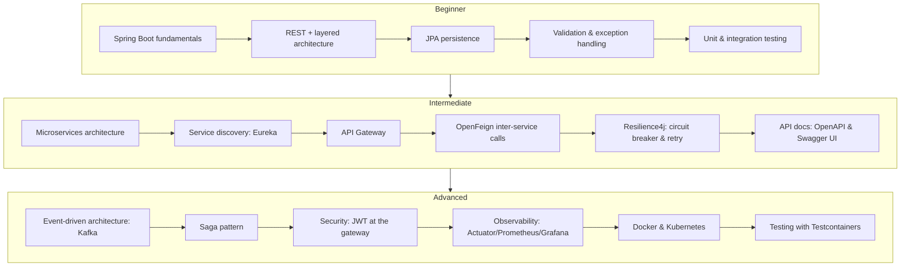

# Course Overview

## Who this is for

Three audiences, one codebase:

* **Beginner** — comfortable with core Java, new to Spring Boot and REST APIs.
* **Intermediate** — comfortable building a single Spring Boot service, new to microservices concerns (discovery, gateways, resilience).
* **Advanced** — comfortable with synchronous microservices, ready for event-driven architecture, distributed transactions, security and production operations.

## How the course is structured

Each level is a folder of numbered Markdown lessons under `docs/`. Every lesson:

1. Explains **one concept** in isolation.
2. Points at the **exact files** in `order-management-system/` that implement it.
3. Gives you **commands to run** and requests to send so you see it work.
4. Ends with **exercises** and **key takeaways**.

You do not need to write the reference project from scratch — it already
works (`mvn clean install` builds and tests every module). Your job as a
learner is to read the lesson, run the corresponding service, poke it with
real HTTP requests, then do the exercises, which typically ask you to modify
or extend the code.

## Learning path



## Project layout

```
order-management-system/
├── common-events/         shared Kafka event contracts (records)
├── eureka-server/          service registry
├── api-gateway/            Spring Cloud Gateway + JWT auth
├── customer-service/       Beginner: REST + JPA CRUD
├── product-service/        Beginner/Intermediate: catalog + inventory
├── order-service/          Intermediate/Advanced: orchestrator (Feign, Resilience4j, Kafka)
├── payment-service/        Advanced: Kafka consumer/producer, simulated payments
├── notification-service/   Advanced: Kafka consumer, simulated notifications
├── docker-compose.yml       Kafka + all services
├── observability/           Prometheus + Grafana compose stack
└── k8s/                     sample Kubernetes manifests
```

Continue to [Beginner Lesson 01](beginner/01-spring-boot-fundamentals.md).

For a single end-to-end explanation that connects the requirements, design,
data model, code layers, service wiring, Kafka, Swagger, testing, Docker, and
Kubernetes, see the [End-to-End Microservices Tutorial](end-to-end-microservices-tutorial.md).
