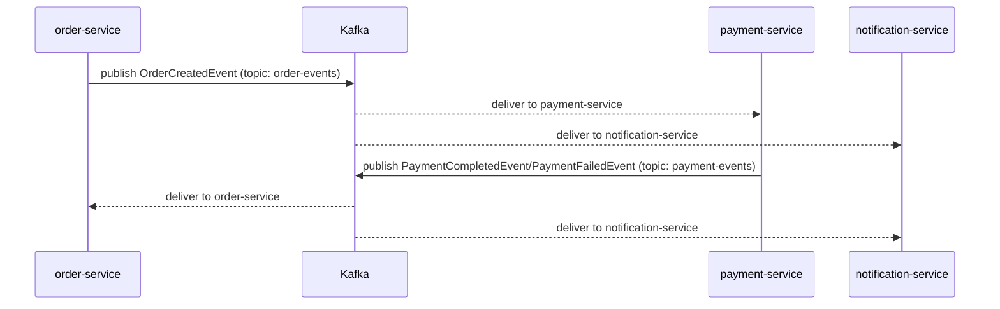

# Advanced · Lesson 01 — Event-Driven Architecture with Kafka

## Goal

Understand why `order-service` publishes an event instead of calling
`payment-service` synchronously, and how Spring Kafka producers/consumers
work.

## Why not just another Feign call?

`order-service` *could* call `payment-service` synchronously, the same way
it calls `customer-service`. But payment processing can be slow (external
payment providers, fraud checks) and the customer shouldn't sit waiting on an
HTTP connection for it. Worse, a synchronous chain
`order → payment → notification` means **all three** services must be up and
fast for an order to succeed at all — exactly the cascading-coupling problem
from the Intermediate module, just moved one level up.

**Event-driven architecture** decouples this: `order-service` publishes a
fact ("this order was created") and moves on. Any number of other services
can react to that fact, independently, at their own pace, without
`order-service` knowing or caring who's listening.



## Shared event contracts: `common-events`

```java
public record OrderCreatedEvent(
        Long orderId, Long customerId, List<OrderLine> items,
        BigDecimal totalAmount, Instant occurredAt
) {
    public record OrderLine(Long productId, int quantity, BigDecimal unitPrice) {}
}
```

See [`common-events`](../../order-management-system/common-events/src/main/java/com/training/oms/events).
This tiny module is a Maven dependency of `order-service`, `payment-service`
and `notification-service` — the "shared kernel" for event *contracts* only
(never business logic). Java **records** are ideal here: immutable,
structurally obvious, and Jackson serializes/deserializes them with zero
configuration.

## Producing an event

```java
@Component
public class OrderEventProducer {
    public static final String TOPIC = "order-events";
    private final KafkaTemplate<String, Object> kafkaTemplate;

    public void publishOrderCreated(OrderCreatedEvent event) {
        kafkaTemplate.send(TOPIC, String.valueOf(event.orderId()), event)
                .whenComplete((result, ex) -> { ... });
    }
}
```

See [`OrderEventProducer.java`](../../order-management-system/order-service/src/main/java/com/training/oms/order/messaging/OrderEventProducer.java).

The **key** (`String.valueOf(event.orderId())`) matters: Kafka guarantees
ordering *within a partition*, and messages with the same key always land on
the same partition. Keying by `orderId` means every event about the same
order is processed in order, even though the topic as a whole is processed by
multiple consumers in parallel.

## Consuming an event

```java
@KafkaListener(topics = "order-events", groupId = "payment-service")
public void onOrderCreated(OrderCreatedEvent event) {
    paymentProcessor.process(event);
}
```

See [`OrderEventListener.java`](../../order-management-system/payment-service/src/main/java/com/training/oms/payment/messaging/OrderEventListener.java).

`groupId` is what makes this a proper **consumer group**: if you run three
instances of `payment-service`, Kafka splits the topic's partitions among
them so each event is processed exactly once *within the group* — but
`notification-service`, in a *different* consumer group, independently
receives its own copy of every event. This is how one event fans out to
multiple, unrelated reactions.

## JSON (de)serialization configuration

```yaml
spring:
  kafka:
    consumer:
      value-deserializer: org.springframework.kafka.support.serializer.ErrorHandlingDeserializer
      properties:
        spring.deserializer.value.delegate.class: org.springframework.kafka.support.serializer.JsonDeserializer
        spring.json.trusted.packages: com.training.oms.events
```

See [`order-service/application.yml`](../../order-management-system/order-service/src/main/resources/application.yml).
`ErrorHandlingDeserializer` wraps the real `JsonDeserializer` so a single
malformed/poison message logs an error and gets skipped instead of crashing
the whole listener container. `spring.json.trusted.packages` is a
**deserialization allow-list** — without it, `JsonDeserializer` refuses to
instantiate arbitrary classes from untrusted JSON, a defense against
deserialization-gadget attacks (OWASP A08: Software and Data Integrity
Failures).

## Run it

```bash
docker compose up -d kafka        # from order-management-system/
# then start eureka-server, customer-service, product-service, order-service, payment-service, notification-service
```

```bash
curl -X POST http://localhost:8083/api/orders \
  -H "Content-Type: application/json" \
  -d '{"customerId":1,"items":[{"productId":1,"quantity":2}]}'
```

Watch the `payment-service` and `notification-service` console logs — both
react to the same `OrderCreatedEvent` independently, seconds apart from the
HTTP response `order-service` already returned to the caller.

## Try it yourself

Use `docker compose up -d kafka-ui` and browse to http://localhost:8090 to
watch messages land on `order-events` and `payment-events` in real time.

## Key takeaways

* Events decouple producers from consumers — the producer doesn't know or care who's listening.
* Partition key choice determines per-entity ordering guarantees.
* `groupId` controls fan-out: same group = load-balanced (each message once); different groups = broadcast (each group gets every message).
* Always set a deserialization trusted-packages allow-list.

Next: [Lesson 02 — The Saga Pattern](02-saga-pattern.md)
