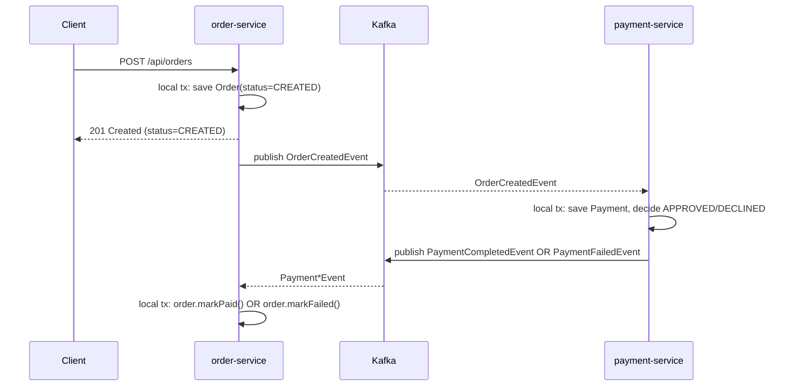

# Advanced · Lesson 02 — The Saga Pattern

## Goal

Understand how a "distributed transaction" works when there's no single
database transaction to roll back — using the choreographed Saga already
running across `order-service` and `payment-service`.

## Why not just use a distributed transaction?

A classic two-phase-commit (2PC) transaction across `orderdb` and
`paymentdb` would require both databases to support XA transactions, hold
locks across a network round-trip, and block if either service is slow — it
does not scale for microservices and most modern databases/brokers don't
even support it well. Instead, we accept that each service commits its own
**local** transaction, and design the overall business transaction as a
sequence of local transactions coordinated by events. This is a **Saga**.

## Choreography vs. orchestration

* **Choreography** (this project): each service listens for events and
  decides its own next step. No central coordinator.
* **Orchestration**: a central "saga orchestrator" service explicitly tells
  each participant what to do next, and tracks saga state itself.

This course uses choreography because it's simpler to reason about at this
scale (2-3 participants); orchestration tends to win once a saga has many
steps or needs a visual audit trail — a good "extend this project" exercise.

## The saga, step by step



Every arrow across a service boundary is either an HTTP response the client
already received, or a Kafka event — there is no lock held across services at
any point.

## Step 1 — the local transaction that starts the saga

```java
Order order = orderRepository.save(new Order(request.customerId(), items));
orderEventProducer.publishOrderCreated(new OrderCreatedEvent(...));
```

See [`OrderService.createOrder`](../../order-management-system/order-service/src/main/java/com/training/oms/order/service/OrderService.java).
The order is saved as `CREATED` *before* anyone downstream has even heard
about it — this local commit is the saga's starting point of no return.

## Step 2 — the participant's local decision

```java
boolean approved = event.totalAmount().compareTo(AUTO_DECLINE_THRESHOLD) <= 0;
if (approved) {
    paymentRepository.save(Payment.approved(...));
    paymentEventProducer.publishCompleted(new PaymentCompletedEvent(...));
} else {
    paymentRepository.save(Payment.declined(...));
    paymentEventProducer.publishFailed(new PaymentFailedEvent(...));
}
```

See [`PaymentProcessor.java`](../../order-management-system/payment-service/src/main/java/com/training/oms/payment/service/PaymentProcessor.java).
`payment-service` never touches `orderdb` — it only knows about the event it
received and its own `paymentdb`.

## Step 3 — completing (or compensating) the saga

```java
@KafkaListener(topics = "payment-events", groupId = "order-service")
public void onPaymentEvent(Object event) {
    if (event instanceof PaymentCompletedEvent completed) {
        orderRepository.findById(completed.orderId()).ifPresent(Order::markPaid);
    } else if (event instanceof PaymentFailedEvent failed) {
        orderRepository.findById(failed.orderId()).ifPresent(Order::markFailed);
        // A production saga would also emit a compensating "ReleaseStockCommand"
        // here so product-service restores the reserved inventory.
    }
}
```

See [`PaymentEventListener.java`](../../order-management-system/order-service/src/main/java/com/training/oms/order/messaging/PaymentEventListener.java).

The `PaymentFailedEvent` branch is a **compensating transaction** — since
there's no distributed rollback, "undoing" the order means explicitly
transitioning it to `FAILED` (and, in a fuller implementation, telling
`product-service` to give the reserved stock back). Compensation is always
business logic you write yourself; it is never automatic.

## Try it yourself

`PaymentProcessor.AUTO_DECLINE_THRESHOLD` is `1000.00`. Place an order whose
total exceeds that (add a high-priced product in `product-service` first),
and watch:

1. `order-service` logs show the order created as `CREATED`.
2. `payment-service` logs show a decline and a `PaymentFailedEvent`.
3. `order-service` logs show the order transition to `FAILED`.

```bash
curl http://localhost:8083/api/orders/{id}   # status: FAILED
```

Then implement the missing compensating step yourself: add a
`releaseStock(productId, quantity)` endpoint to `product-service` and call it
(via Feign) from `PaymentEventListener.handleFailed`.

## Key takeaways

* A Saga replaces one distributed transaction with a sequence of local transactions coordinated by events.
* Choreography = each service reacts independently; orchestration = a central coordinator drives the steps.
* Failure paths need explicit **compensating transactions** — nothing rolls back automatically.

Next: [Lesson 03 — Security: JWT at the Gateway](03-security-jwt.md)
