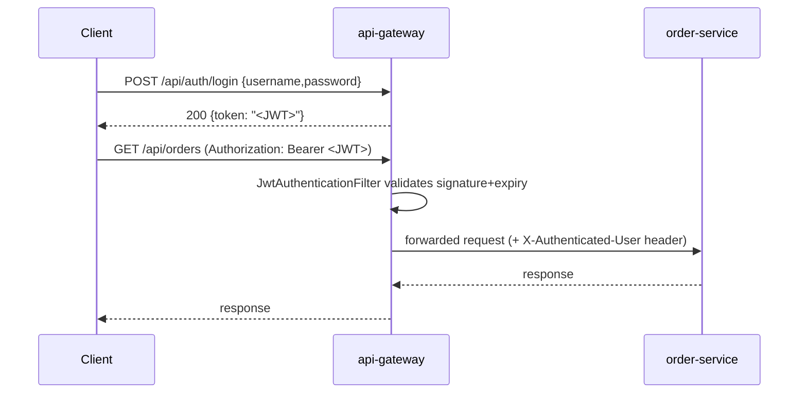

# Advanced · Lesson 03 — Security: JWT at the Gateway

## Goal

Understand token-based authentication and why it's enforced once, at the
edge, rather than duplicated in every microservice.

> **Scope note:** the `JwtService`/`AuthController` in this project are a
> deliberately minimal, educational stand-in for a real identity provider —
> enough to demonstrate the gateway filter mechanics. In production, delegate
> authentication to a dedicated OAuth2/OIDC provider (Keycloak, Entra ID,
> Auth0, Okta, ...) using `spring-boot-starter-oauth2-resource-server` — see
> "Try it yourself" below.

## Why authenticate at the gateway, not in every service?

If each of `customer-service`, `product-service`, `order-service` and
`payment-service` independently validated credentials, you'd have four
implementations of the same cross-cutting concern to keep in sync and secure.
Instead, [Lesson 03 of the Intermediate module](../intermediate/03-api-gateway.md)
already established the gateway as the single entry point — authentication is
exactly the kind of concern that belongs there, once.



## Issuing a token

```java
public String generateToken(String username, List<String> roles) {
    Instant now = Instant.now();
    return Jwts.builder()
            .subject(username)
            .claim("roles", roles)
            .issuedAt(Date.from(now))
            .expiration(Date.from(now.plusSeconds(expirationMinutes * 60)))
            .signWith(key)
            .compact();
}
```

See [`JwtService.java`](../../order-management-system/api-gateway/src/main/java/com/training/oms/gateway/security/JwtService.java)
and [`AuthController.java`](../../order-management-system/api-gateway/src/main/java/com/training/oms/gateway/security/AuthController.java).
A JWT is a signed, self-contained token: `header.payload.signature`, Base64URL
encoded. Anyone can *read* the payload (it's not encrypted), but only someone
holding the secret key can produce a valid signature — that's what
`JwtAuthenticationFilter` checks, not the content itself.

## Enforcing it: a reactive `GlobalFilter`

Spring Cloud Gateway is built on WebFlux (reactive, non-blocking), so the
enforcement filter looks different from a classic servlet `Filter`:

```java
@Component
public class JwtAuthenticationFilter implements GlobalFilter, Ordered {

    @Override
    public Mono<Void> filter(ServerWebExchange exchange, GatewayFilterChain chain) {
        String path = exchange.getRequest().getURI().getPath();
        if (PUBLIC_PATHS.stream().anyMatch(path::startsWith)) {
            return chain.filter(exchange);           // /api/auth/login, /actuator - no token required
        }
        String authHeader = exchange.getRequest().getHeaders().getFirst("Authorization");
        if (authHeader == null || !authHeader.startsWith("Bearer ")) {
            return unauthorized(exchange, "Missing bearer token");
        }
        try {
            String username = jwtService.parseClaims(authHeader.substring(7)).getSubject();
            ServerHttpRequest mutated = exchange.getRequest().mutate()
                    .header("X-Authenticated-User", username).build();
            return chain.filter(exchange.mutate().request(mutated).build());
        } catch (JwtException ex) {
            return unauthorized(exchange, "Invalid or expired token");
        }
    }
}
```

See [`JwtAuthenticationFilter.java`](../../order-management-system/api-gateway/src/main/java/com/training/oms/gateway/security/JwtAuthenticationFilter.java).

* It returns `Mono<Void>`, not `void` — WebFlux is non-blocking, so the filter must be written in a reactive, callback style rather than blocking the thread.
* Everything but `/api/auth/login` and `/actuator` requires a valid `Bearer` token.
* On success, it forwards the request with an `X-Authenticated-User` header — downstream services trust the gateway to have already authenticated the caller (this trust boundary is only safe because these services are *not* directly reachable from outside the cluster/network — see [Lesson 05](05-containerization-docker-kubernetes.md)).

## Try it yourself

```bash
TOKEN=$(curl -s -X POST http://localhost:8080/api/auth/login \
  -H "Content-Type: application/json" -d '{"username":"admin","password":"admin123"}' | jq -r .token)

curl http://localhost:8080/api/orders                              # 401 Missing bearer token
curl -H "Authorization: Bearer $TOKEN" http://localhost:8080/api/orders   # 200
```

**Exercise (production-hardening path):** replace `JwtService`/`AuthController`
with `spring-boot-starter-oauth2-resource-server` configured against a real
OIDC provider, and delete the demo in-memory user map — the
`JwtAuthenticationFilter`'s *shape* (validate → mutate request → forward)
stays conceptually the same; only where the token comes from and how it's
verified changes.

## Key takeaways

* Authenticate once, at the gateway — don't duplicate it in every microservice.
* JWTs are signed and verifiable, not encrypted — never put secrets in the claims.
* Never hardcode/commit real signing secrets — inject via environment variable or secrets manager (the demo secret here is intentionally labeled as such).
* Gateway filters in Spring Cloud Gateway (WebFlux) are reactive — return `Mono<Void>`, don't block.

Next: [Lesson 04 — Observability: Actuator, Prometheus & Grafana](04-observability.md)
