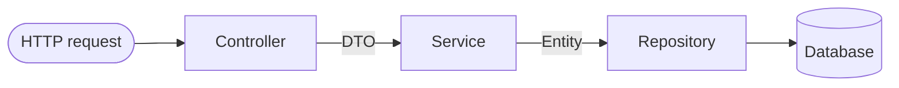

# Beginner · Lesson 02 — REST APIs & Layered Architecture

## Goal

Understand the Controller → Service → Repository layering used by every
service in this course, using [`customer-service`](../../order-management-system/customer-service).

## The three layers



| Layer | Class | Responsibility |
|---|---|---|
| Controller | [`CustomerController`](../../order-management-system/customer-service/src/main/java/com/training/oms/customer/controller/CustomerController.java) | HTTP concerns only: routes, status codes, request/response mapping |
| Service | [`CustomerService`](../../order-management-system/customer-service/src/main/java/com/training/oms/customer/service/CustomerService.java) | Business logic, transactions |
| Repository | [`CustomerRepository`](../../order-management-system/customer-service/src/main/java/com/training/oms/customer/repository/CustomerRepository.java) | Data access only |

Why bother separating these? The controller shouldn't know about SQL; the
repository shouldn't know about HTTP status codes. Each layer is independently
testable (see Lesson 05) and replaceable (swap REST for GraphQL without
touching the service layer; swap JPA for MongoDB without touching the
controller).

## The controller

```java
@RestController
@RequestMapping("/api/customers")
public class CustomerController {

    private final CustomerService customerService;

    public CustomerController(CustomerService customerService) { // constructor injection
        this.customerService = customerService;
    }

    @PostMapping
    public ResponseEntity<CustomerResponse> create(@Valid @RequestBody CustomerRequest request) {
        CustomerResponse created = customerService.create(request);
        return ResponseEntity.created(URI.create("/api/customers/" + created.id())).body(created);
    }
    ...
}
```

Notes:

* **Constructor injection**, not `@Autowired` field injection. This makes the class easier to unit test (see Lesson 05) and impossible to construct in a half-initialized state.
* `@Valid` triggers Bean Validation on the incoming `CustomerRequest` (Lesson 04).
* Returning `ResponseEntity.created(...)` sets HTTP 201 + a `Location` header, per REST convention for "resource created."

## DTOs vs Entities

Compare [`Customer`](../../order-management-system/customer-service/src/main/java/com/training/oms/customer/domain/Customer.java) (the JPA `@Entity`) with [`CustomerRequest`/`CustomerResponse`](../../order-management-system/customer-service/src/main/java/com/training/oms/customer/dto) (plain Java **records** used as DTOs).

Never return `@Entity` objects directly from a controller:

* You'd leak lazy-loading proxies and JPA internals into your JSON.
* You couldn't validate incoming data with annotations cleanly.
* Your API contract would be permanently coupled to your database schema.

Records are a perfect fit for DTOs — immutable, concise, free `equals()`/`hashCode()`/`toString()`.

## REST verbs used in this course

| Verb | Endpoint | Meaning |
|---|---|---|
| `POST /api/customers` | Create | 201 + Location header |
| `GET /api/customers/{id}` | Read one | 200 or 404 |
| `GET /api/customers` | Read all | 200 |
| `PUT /api/customers/{id}` | Full update | 200 |
| `DELETE /api/customers/{id}` | Delete | 204 |

## Try it yourself

```bash
curl -X POST http://localhost:8081/api/customers \
  -H "Content-Type: application/json" \
  -d '{"name":"Dana Lee","email":"dana@example.com","phone":"555-0111","address":"5 River Rd"}'

curl http://localhost:8081/api/customers
```

**Exercise:** Add a `GET /api/customers/search?email=...` endpoint that uses
`CustomerRepository.findByEmail` (already defined) and returns 404 via
`CustomerNotFoundException` if nothing matches.

## Key takeaways

* Controller → Service → Repository keeps HTTP, business logic, and persistence independently testable and replaceable.
* Always use constructor injection.
* Never expose JPA entities directly — map to DTOs (records are ideal).

Next: [Lesson 03 — JPA Persistence](03-jpa-persistence.md)
