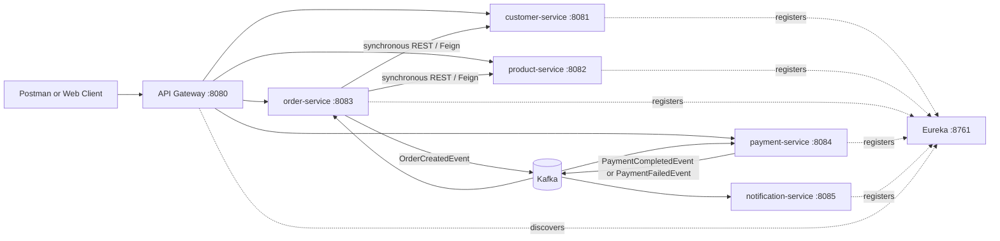
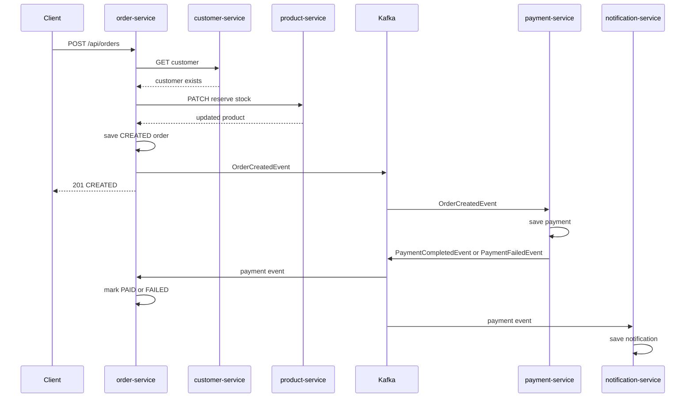

# End-to-End Microservices Tutorial

## Build an Order Management System with Spring Boot

This tutorial explains how to design and build a small but realistic
microservices system from the beginning. It uses the working project in
`order-management-system/` as the reference implementation.

The goal is not only to make the application run. The goal is to understand
why each service exists, how its files fit together, how services communicate,
and how the system grows from one simple REST service into a distributed,
event-driven application.

## 1. Learning outcome

By the end, a beginner should be able to:

- turn business requirements into service boundaries
- draw a high-level architecture before coding
- design a small data model for each service
- create a Spring Boot service with controller, service, repository, entity,
  DTO, validation, and exception-handling layers
- expose REST endpoints and document them with OpenAPI/Swagger
- register services with Eureka
- route client traffic through an API Gateway
- call another service with OpenFeign
- add timeout, retry, and circuit-breaker protection
- publish and consume Kafka events
- understand a choreography-based Saga
- secure gateway endpoints with JWT
- test services at unit, web, integration, and container levels
- package the services with Docker and run them with Docker Compose
- understand how the same services are scaled with Kubernetes

The project uses Java 21, Spring Boot 3.3.4, Spring Cloud 2023.0.3, Maven,
H2, Kafka, Eureka, Spring Cloud Gateway, OpenFeign, Resilience4j, JJWT,
OpenAPI, Docker, and Kubernetes manifests.

## 2. Start with the business requirements

Before choosing Spring Boot annotations or creating packages, describe what the
business needs.

### 2.1 Business problem

A customer should be able to buy products. The system must:

1. store customer details
2. store products and available stock
3. validate that a customer and products exist
4. reserve stock when an order is placed
5. calculate the order total
6. process a simulated payment
7. record whether payment was approved or declined
8. notify the customer about order and payment progress
9. expose APIs for clients such as Postman or a web application
10. continue operating safely when a downstream service is unavailable

### 2.2 Functional requirements

Write requirements as observable behavior:

| ID | Requirement | Observable result |
|---|---|---|
| FR-01 | Create a customer | `POST /api/customers` returns `201 Created` |
| FR-02 | List customers | `GET /api/customers` returns customer records |
| FR-03 | Create a product | `POST /api/products` stores price and stock |
| FR-04 | Reserve stock | `PATCH /api/products/{id}/reserve-stock` deducts stock |
| FR-05 | Place an order | `POST /api/orders` validates dependencies and creates an order |
| FR-06 | Process payment | A payment record is approved or declined asynchronously |
| FR-07 | Update order outcome | The order eventually becomes `PAID` or `FAILED` |
| FR-08 | Notify customer | A notification is recorded for order and payment events |
| FR-09 | Secure APIs | Gateway requests need a valid JWT |
| FR-10 | Document APIs | Each service exposes Swagger UI and an OpenAPI document |

### 2.3 Non-functional requirements

These describe quality rather than business actions:

- services should be independently deployable
- each service should own its data
- a temporary downstream failure should not freeze all callers
- clients should have one entry point through the gateway
- asynchronous work should not require a long synchronous request chain
- APIs should be testable and self-documenting
- the system should be runnable locally with Docker Compose
- the system should be scalable to multiple service instances

### 2.4 Important boundaries

A requirement such as “place an order” crosses several technical actions, but
it does not mean one service should own every table. Separate ownership first:

- customer information belongs to `customer-service`
- product catalog and inventory belong to `product-service`
- order state and order items belong to `order-service`
- payment state belongs to `payment-service`
- notification history belongs to `notification-service`

This gives each service a clear reason to change.

## 3. High-level architecture

Start with a context diagram, not a class diagram.



### 3.1 Why these infrastructure components exist

- **Eureka** answers: “Where is an instance of `product-service` running?”
- **API Gateway** answers: “Where should an external client send requests, and
  how is authentication applied consistently?”
- **OpenFeign** answers: “How can order-service call another service using a
  typed Java client instead of manually building HTTP requests?”
- **Resilience4j** answers: “What should happen when that service is slow or
  unavailable?”
- **Kafka** answers: “How can services react to business events without a
  direct request from the original caller?”
- **Docker Compose** answers: “How can a learner start the whole local system?”
- **Kubernetes** answers: “How can the same service be replicated and managed
  in a cluster?”

### 3.2 Synchronous versus asynchronous communication

Use synchronous REST when the caller needs an immediate answer:

```text
order-service -> customer-service: Is customer 3 valid?
order-service -> product-service: What is product 4 and can I reserve stock?
```

Use asynchronous events when another service can react later:

```text
order-service -> Kafka: OrderCreatedEvent
payment-service -> Kafka: PaymentCompletedEvent or PaymentFailedEvent
notification-service -> local notification store
order-service -> local order status update
```

A request can therefore return `CREATED` first. The final payment result is
observed a moment later by polling the order or receiving a client event.

## 4. Detailed design before coding

Detailed design converts the architecture into responsibilities, APIs, data,
and workflows.

### 4.1 Service responsibility table

| Service | Owns | Main APIs | Communication |
|---|---|---|---|
| `customer-service` | customer profile | `/api/customers` | REST/JPA |
| `product-service` | product and stock | `/api/products` | REST/JPA |
| `order-service` | orders and items | `/api/orders` | REST, Feign, Kafka |
| `payment-service` | payments | `/api/payments` | Kafka in, Kafka out |
| `notification-service` | notification records | `/api/notifications` | Kafka in |
| `api-gateway` | routing and authentication | `/api/auth/login` | Gateway/Eureka |
| `eureka-server` | service registry | Eureka endpoints | Discovery |
| `common-events` | event contracts | Java records | Maven dependency |

### 4.2 API design rules

For every endpoint decide:

- HTTP method
- URL and path variables
- request JSON
- response JSON
- success status code
- validation rules
- error status codes
- whether authentication is required
- whether the operation is synchronous or starts asynchronous work

Example order endpoint:

```http
POST /api/orders
Content-Type: application/json
Authorization: Bearer <token>

{
  "customerId": 3,
  "items": [
    { "productId": 4, "quantity": 2 },
    { "productId": 5, "quantity": 1 }
  ]
}
```

Immediate response:

```json
{
  "id": 1,
  "customerId": 3,
  "status": "CREATED",
  "totalAmount": 129.97,
  "createdAt": "2026-09-06T07:34:17Z",
  "items": [
    { "productId": 4, "quantity": 2, "unitPrice": 19.99 },
    { "productId": 5, "quantity": 1, "unitPrice": 89.99 }
  ]
}
```

Later, after Kafka processing, the status becomes `PAID` or `FAILED`.

### 4.3 Workflow design

The order workflow is deliberately split into two phases:

**Phase A: synchronous validation and reservation**

1. receive the order request
2. load the customer through Feign
3. load each product through Feign
4. reserve product stock through `PATCH`
5. calculate the total
6. save the order as `CREATED`
7. publish `OrderCreatedEvent`
8. return the created order

**Phase B: asynchronous payment and completion**

1. payment-service consumes `OrderCreatedEvent`
2. payment-service saves a payment
3. amount `<= 1000.00` is approved; larger amounts are declined
4. payment-service publishes a payment event
5. order-service consumes it and marks the order `PAID` or `FAILED`
6. notification-service records a payment notification

This is a choreography-based Saga: there is no central transaction manager
coordinating every database. Each service completes its own local transaction
when it receives the relevant event.

## 5. Data model design

### 5.1 Data ownership principle

Do not create one shared database schema for all services. A service should own
its tables and expose behavior through APIs or events.

For this training system each H2 database is separate in configuration:

- `customerdb`
- `productdb`
- `orderdb`
- `paymentdb`
- notification data is held in an in-memory store

In production, these could become separate PostgreSQL schemas, databases, or
managed database instances, depending on isolation and operational needs.

### 5.2 Customer model

```text
Customer
--------
id: Long, generated primary key
name: String, required
email: String, required and unique by business rule
phone: String, optional
address: String, optional
```

The entity is in:

`order-management-system/customer-service/src/main/java/com/training/oms/customer/domain/Customer.java`

The request and response models are separate from the entity:

- `customer-service/.../dto/CustomerRequest.java`
- `customer-service/.../dto/CustomerResponse.java`

### 5.3 Product model

```text
Product
-------
id: Long, generated primary key
name: String, required
description: String, optional
price: BigDecimal, positive
stockQuantity: int, zero or greater
version: Long, used for optimistic locking
```

The `version` field helps prevent two concurrent reservations from silently
overwriting one another. The model is in:

`order-management-system/product-service/src/main/java/com/training/oms/product/domain/Product.java`

### 5.4 Order model

```text
Order
-----
id: Long, generated primary key
customerId: Long, reference to customer-service by ID
status: CREATED | PAYMENT_PENDING | PAID | FAILED | CANCELLED
totalAmount: BigDecimal
createdAt: Instant
items: collection of OrderItem

OrderItem
---------id: Long
productId: Long, reference to product-service by ID
quantity: int
unitPrice: BigDecimal, copied at order time
```

Notice that `OrderItem` stores `unitPrice`. It should not recalculate a past
order using today's catalog price.

The order model is in:

- `order-service/.../domain/Order.java`
- `order-service/.../domain/OrderItem.java`
- `order-service/.../domain/OrderStatus.java`

### 5.5 Payment and notification models

Payment owns the payment result:

```text
Payment
-------
id
orderId
amount
status: APPROVED | DECLINED
declineReason
processedAt
```

Events own the cross-service message contract:

- `common-events/.../OrderCreatedEvent.java`
- `common-events/.../PaymentCompletedEvent.java`
- `common-events/.../PaymentFailedEvent.java`

A notification is an observable record containing `sentAt`, `orderId`,
`channel`, and `message`.

## 6. Maven multi-module project design

The root `pom.xml` is a Maven aggregator. It lists the modules and centralizes
versions:

```xml
<modules>
    <module>common-events</module>
    <module>eureka-server</module>
    <module>api-gateway</module>
    <module>customer-service</module>
    <module>product-service</module>
    <module>order-service</module>
    <module>payment-service</module>
    <module>notification-service</module>
</modules>
```

The usual build command is:

```powershell
Set-Location "d:\downloads\TRAINING\Project\order-management-system"
mvn clean package -DskipTests
```

The root also binds Spring Boot's `repackage` goal so each service gets an
executable fat jar. The `maven.compiler.parameters` property preserves Java
parameter names for Spring MVC binding.

### 6.1 Why `common-events` is separate

Event contracts are shared, but business ownership is not. The shared module
contains small immutable Java records only. It does not contain repositories,
controllers, or service logic.

A learner can change an event record, rebuild the parent project, and observe
that both producers and consumers must agree on the new contract.

## 7. Build the first service: customer-service

Start with the simplest service. Do not begin with Kafka or Kubernetes.

### 7.1 Create the Spring Boot application

`CustomerServiceApplication.java` is the entry point. It contains the
`@SpringBootApplication` annotation, which enables component scanning and
configuration.

### 7.2 Create the entity

`Customer.java` maps Java fields to the `customers` table using JPA annotations.
The entity is persistence state, not the public API contract.

### 7.3 Create the repository

`CustomerRepository.java` extends Spring Data JPA's repository abstraction.
Spring generates standard CRUD operations such as `findById`, `findAll`,
`save`, and `deleteById`.

### 7.4 Create request and response DTOs

`CustomerRequest` contains fields accepted from clients and validation rules.
`CustomerResponse` contains fields returned to clients.

This separation prevents database implementation details from becoming a public
contract.

### 7.5 Create the service layer

`CustomerService.java` owns use-case logic:

- create a customer
- reject duplicate email addresses
- find a customer or throw a domain exception
- update a customer
- delete a customer

The controller should delegate here rather than contain business rules.

### 7.6 Create the controller

`CustomerController.java` maps HTTP requests:

```java
@RestController
@RequestMapping("/api/customers")
public class CustomerController {
    @PostMapping
    public ResponseEntity<CustomerResponse> create(...) { ... }

    @GetMapping("/{id}")
    public CustomerResponse getById(@PathVariable Long id) { ... }
}
```

The normal request flow is:

```text
HTTP request
  -> Controller
  -> Request DTO validation
  -> Service use case
  -> Repository
  -> Entity/database
  -> Response DTO
  -> HTTP response
```

### 7.7 Add centralized exception handling

`GlobalExceptionHandler.java` uses `@RestControllerAdvice` to translate
exceptions into predictable HTTP responses:

- unknown customer: `404 Not Found`
- duplicate email: `409 Conflict`
- invalid request: `400 Bad Request`

This keeps controllers readable and gives clients a stable error format.

## 8. Build product-service and inventory behavior

`product-service` follows the same layers as customer-service:

```text
product-service/
├── src/main/java/com/training/oms/product/
│   ├── ProductServiceApplication.java
│   ├── controller/ProductController.java
│   ├── domain/Product.java
│   ├── dto/ProductRequest.java
│   ├── dto/ProductResponse.java
│   ├── dto/StockReservationRequest.java
│   ├── exception/
│   ├── repository/ProductRepository.java
│   └── service/ProductService.java
└── src/main/resources/
    ├── application.yml
    └── data.sql
```

The important additional use case is stock reservation:

```http
PATCH /api/products/{id}/reserve-stock

{ "quantity": 2 }
```

The service must check:

1. the product exists
2. quantity is at least 1
3. available stock is sufficient
4. stock is deducted atomically
5. the updated product is returned

Insufficient stock is mapped to `409 Conflict`. This is a business conflict,
not a malformed request.

## 9. Add service discovery with Eureka

When services run locally, fixed URLs are easy. In a cluster, instances move,
scale, and restart. Eureka provides a registry.

### 9.1 Eureka server

The entry point is:

`eureka-server/src/main/java/com/training/oms/eureka/EurekaServerApplication.java`

It enables the Eureka server. Its port is `8761`.

Dashboard:

```text
http://localhost:8761
```

### 9.2 Eureka clients

Each service configures its application name and Eureka URL in
`src/main/resources/application.yml`:

```yaml
spring:
  application:
    name: customer-service

eureka:
  client:
    service-url:
      defaultZone: http://localhost:8761/eureka/
```

The application name becomes the logical service identity. Other services can
ask Eureka for instances of `customer-service` instead of hardcoding a host.

## 10. Add the API Gateway

The gateway is the public edge of the system. External clients use one base
URL:

```text
http://localhost:8080
```

Routes are configured in:

`api-gateway/src/main/resources/application.yml`

Example:

```yaml
- id: customer-service
  uri: lb://customer-service
  predicates:
    - Path=/api/customers/**
```

`lb://customer-service` means that Spring Cloud LoadBalancer resolves the
service through discovery and can choose among multiple healthy instances.

The gateway also exposes the login endpoint:

`api-gateway/src/main/java/com/training/oms/gateway/security/AuthController.java`

Use:

```http
POST /api/auth/login

{ "username": "admin", "password": "admin123" }
```

The JWT filter is:

`api-gateway/src/main/java/com/training/oms/gateway/security/JwtAuthenticationFilter.java`

Its job is to:

1. allow public paths such as login and documentation
2. read the `Authorization: Bearer ...` header
3. validate the token
4. add the authenticated user to the forwarded request
5. reject missing or invalid tokens with `401 Unauthorized`

## 11. Add OpenFeign for service-to-service calls

`order-service` needs customer and product information. It uses typed Feign
clients:

- `order-service/.../client/CustomerClient.java`
- `order-service/.../client/ProductClient.java`

A client method looks conceptually like this:

```java
@FeignClient(name = "product-service")
public interface ProductClient {
    @GetMapping("/api/products/{id}")
    ProductDto getProduct(@PathVariable Long id);

    @PatchMapping("/api/products/{id}/reserve-stock")
    ProductDto reserveStock(@PathVariable Long id,
                            @RequestBody StockReservationRequest request);
}
```

The `name` is the Eureka service name. There is no fixed host in the Java code.

The `order-service/pom.xml` includes `feign-hc5` because the stock endpoint uses
`PATCH`; the JDK's default URL connection client does not support PATCH in this
configuration.

### 11.1 Keep remote DTOs small

`CustomerDto.java` and `ProductDto.java` are local representations of data
needed by order-service. Do not share JPA entities between services. Sharing
entities couples database design and deployment unnecessarily.

### 11.2 Add a gateway around remote calls

`CustomerGateway.java` and `ProductGateway.java` are service-layer wrappers
around Feign clients. They are useful places to apply retries, circuit breakers,
and domain-specific error handling.

## 12. Add Resilience4j

A network call can fail even when the code is correct. In
`order-service/src/main/resources/application.yml`, Resilience4j configures:

- circuit-breaker window size
- failure threshold
- open-state duration
- retry count
- retry delay
- Feign connect and read timeouts

The intended flow is:

```text
Order service calls customer service
  -> timeout or connection failure
  -> retry a small number of times
  -> circuit breaker records failures
  -> open circuit rejects calls quickly
  -> client receives a controlled 503 response
```

A circuit breaker is not a replacement for fixing outages. It protects the
caller from waiting forever and prevents a failing dependency from consuming
all resources.

## 13. Build order-service layer by layer

The important files are:

```text
order-service/src/main/java/com/training/oms/order/
├── OrderServiceApplication.java
├── client/
│   ├── CustomerClient.java
│   ├── CustomerDto.java
│   ├── CustomerGateway.java
│   ├── ProductClient.java
│   ├── ProductDto.java
│   └── ProductGateway.java
├── controller/OrderController.java
├── domain/
│   ├── Order.java
│   ├── OrderItem.java
│   └── OrderStatus.java
├── dto/
│   ├── OrderRequest.java
│   └── OrderResponse.java
├── exception/
├── messaging/OrderEventProducer.java
├── repository/OrderRepository.java
└── service/OrderService.java
```

`OrderService.java` is the central use-case implementation. Teach it in this
order:

1. validate the request DTO
2. call `CustomerGateway`
3. call `ProductGateway` for each item
4. reserve stock
5. create order items with the current unit prices
6. calculate the total using `BigDecimal`
7. save the order
8. publish `OrderCreatedEvent`
9. return `OrderResponse`

The controller remains small:

```java
@PostMapping
public ResponseEntity<OrderResponse> create(@Valid @RequestBody OrderRequest request) {
    OrderResponse created = orderService.createOrder(request);
    return ResponseEntity.created(...).body(created);
}
```

This is a good moment to teach an important rule: a controller coordinates HTTP,
not business decisions.

## 14. Add Kafka and event contracts

### 14.1 Define immutable event records

`common-events` contains records such as:

```java
public record OrderCreatedEvent(
        Long orderId,
        Long customerId,
        BigDecimal totalAmount,
        Instant occurredAt) {
}
```

Events should contain facts that happened, not commands disguised as facts.
`OrderCreatedEvent` says an order was created. It does not say “payment-service,
you must approve this.”

### 14.2 Publish the order event

`order-service/.../messaging/OrderEventProducer.java` sends the event to the
`order-events` topic using `KafkaTemplate`.

### 14.3 Consume and produce in payment-service

`payment-service/.../messaging/OrderEventListener.java` consumes
`OrderCreatedEvent`.

`PaymentProcessor.java` applies the training rule:

```text
amount <= 1000.00 -> APPROVED
amount >  1000.00 -> DECLINED
```

`PaymentEventProducer.java` publishes either:

- `PaymentCompletedEvent`
- `PaymentFailedEvent`

### 14.4 Consume events correctly when multiple types exist

When one Kafka topic carries multiple event classes, use the class-level
listener and typed handlers:

```java
@Component
@KafkaListener(topics = "payment-events", groupId = "order-service")
public class PaymentEventListener {
    @KafkaHandler
    public void onPaymentCompleted(PaymentCompletedEvent event) { ... }

    @KafkaHandler
    public void onPaymentFailed(PaymentFailedEvent event) { ... }
}
```

Do not use one listener method with a plain `Object event` parameter for this
case. Spring Kafka can bind that parameter to the raw `ConsumerRecord`, causing
the event-specific logic to be skipped silently.

## 15. Implement the Saga completion

`order-service/.../messaging/PaymentEventListener.java` handles the payment
outcome:

- completed payment -> `order.markPaid()`
- failed payment -> `order.markFailed()`

`notification-service` has two listeners:

- `NotificationEventListener.java` handles `OrderCreatedEvent`
- `PaymentEventNotificationListener.java` handles the two payment event types

The resulting business flow is:



### 15.1 Saga limitation in this training project

Stock is reserved before payment. If payment is declined, stock remains
reserved because this demonstration does not implement a compensating
`ReleaseStock` event.

A production design could add:

```text
PaymentFailedEvent
  -> product-service consumes compensation command/event
  -> reserved stock is released
```

That is a useful exercise for learners.

## 16. Add Swagger/OpenAPI

Each service uses `springdoc-openapi-starter` and has an `OpenApiConfig.java`
file. For example:

`customer-service/.../config/OpenApiConfig.java`

The controller uses OpenAPI annotations such as:

```java
@Tag(name = "Customers", description = "CRUD operations for customers")
@Operation(summary = "Create a customer")
```

Springdoc scans controllers and generates the OpenAPI document.

Useful URLs:

| Service | Swagger UI |
|---|---|
| Customer | `http://localhost:8081/swagger-ui.html` |
| Product | `http://localhost:8082/swagger-ui.html` |
| Order | `http://localhost:8083/swagger-ui.html` |
| Payment | `http://localhost:8084/swagger-ui.html` |
| Gateway aggregate | `http://localhost:8080/swagger-ui.html` |

OpenAPI JSON is available at `/v3/api-docs`. The gateway rewrites service
OpenAPI paths such as `/docs/order-service/v3/api-docs` so one Swagger UI can
show multiple services.

Teach beginners to use annotations for descriptions, but not to use Swagger as
a substitute for clear API design. The request and response DTOs remain the
real contract.

## 17. Testing strategy

Use several test layers because each catches a different problem.

### 17.1 Unit tests

Test one class without starting the whole application:

- customer service business rules
- product stock rules
- order total calculation
- payment approval/decline threshold

Examples:

- `customer-service/src/test/java/.../CustomerServiceTest.java`
- `product-service/src/test/java/.../ProductServiceTest.java`
- `order-service/src/test/java/.../OrderServiceTest.java`

### 17.2 Web/controller tests

Use MockMvc to verify:

- URL mapping
- JSON binding
- validation errors
- HTTP status codes
- response shape

Example:

`customer-service/src/test/java/com/training/oms/customer/controller/CustomerControllerTest.java`

### 17.3 Kafka integration tests

`payment-service/src/test/.../PaymentServiceKafkaIT.java` demonstrates testing
the event-driven payment behavior. A stronger production test can run Kafka in
a Testcontainers container.

### 17.4 Manual integration tests

Use the Postman collection under:

`postman/Order-Management-System.postman_collection.json`

Import the matching environment file, run login first, then run the end-to-end
folder from top to bottom. The collection stores generated IDs and checks
`PAID`, `APPROVED`, and notification outcomes.

## 18. Configuration and observability

Each service has an `application.yml` containing:

- server port
- application name
- database settings
- JPA behavior
- Kafka settings where needed
- Eureka settings
- Actuator exposure
- resilience settings where needed

Keep environment-specific values outside Java code. Docker Compose overrides
Eureka and Kafka addresses with container hostnames such as `eureka-server` and
`kafka`.

Actuator health endpoints are useful for operations:

```text
http://localhost:8081/actuator/health
http://localhost:8082/actuator/health
http://localhost:8083/actuator/health
http://localhost:8084/actuator/health
http://localhost:8085/actuator/health
```

The `observability/` folder contains Prometheus and Grafana configuration.
Prometheus scrapes metrics; Grafana displays dashboards. In a real deployment,
centralized logs, distributed tracing, alerting, and correlation IDs should be
added as the number of services grows.

## 19. Docker and local deployment

Every deployable service has a small Dockerfile:

```dockerfile
FROM eclipse-temurin:21-jre-alpine
WORKDIR /app
COPY target/*.jar app.jar
ENTRYPOINT ["java", "-jar", "/app/app.jar"]
```

The normal workflow after source or dependency changes is:

```powershell
Set-Location "d:\downloads\TRAINING\Project\order-management-system"
mvn clean package -DskipTests
docker compose up -d --build
```

When the code and images are already healthy, use the cheaper startup path:

```powershell
docker compose up -d
docker compose ps
```

Do not rebuild healthy code just to start the services.

`docker-compose.yml` starts:

- Kafka
- Kafka UI
- Eureka
- API Gateway
- customer-service
- product-service
- order-service
- payment-service
- notification-service

## 20. Kubernetes mental model

Docker Compose starts named containers on one local machine. Kubernetes manages
Pods, Services, Deployments, health checks, rolling updates, and replicas.

For ten order-service instances, every Pod can listen on the same application
port, for example `8083`:

```text
order-service Pod 1:8083
order-service Pod 2:8083
...
order-service Pod 10:8083
```

A Kubernetes Service gives clients one stable DNS name:

```text
http://order-service:8083
```

The Service load-balances requests across healthy Pods. Clients do not use ten
host ports.

The sample manifests are in:

- `order-management-system/k8s/00-namespace.yaml`
- `order-management-system/k8s/eureka-server.yaml`
- `order-management-system/k8s/order-service.yaml`

A production Kubernetes Deployment normally declares:

```yaml
spec:
  replicas: 10
```

Then add readiness and liveness probes, resource requests and limits, rolling
update rules, secrets/config maps, autoscaling, and an Ingress or Gateway for
external traffic.

## 21. Recommended teaching sequence

Use this order for a classroom or self-study workshop:

### Stage 1: Single-service foundations

1. explain the business requirements
2. build customer-service
3. add entity, repository, service, DTO, controller
4. add validation and exception handling
5. write unit and controller tests
6. inspect Swagger UI

### Stage 2: A second bounded context

7. build product-service
8. add stock reservation
9. discuss separate data ownership
10. test insufficient stock and optimistic locking

### Stage 3: Split the system

11. create Eureka server
12. register customer and product services
13. create API Gateway
14. route and secure requests
15. compare direct service URLs with the gateway URL

### Stage 4: Orchestration

16. create order domain and database tables
17. add Feign clients
18. implement order creation
19. add timeout, retry, and circuit breaker
20. test downstream failure

### Stage 5: Events and distributed workflow

21. create shared event records
22. publish `OrderCreatedEvent`
23. build payment-service consumer
24. publish payment outcome events
25. update order state with typed Kafka handlers
26. add notification-service
27. explain Saga limitations and compensation

### Stage 6: Production concerns

28. add JWT authentication
29. add Actuator, Prometheus, and Grafana
30. package with Docker Compose
31. map the design to Kubernetes Deployments and Services
32. run the Postman integration collection

## 22. Beginner exercises

1. Add a `city` field to customers and update request, entity, response, seed
   data, and tests.
2. Add a product category and a `GET /api/products?category=...` endpoint.
3. Add an order status endpoint that returns a simple status-only response.
4. Add a `ReleaseStockEvent` for declined payments.
5. Add an idempotency key to order creation so a retried client request does
   not create duplicate orders.
6. Add a customer-facing order history endpoint composed from order-service.
7. Add an explicit `@RequestHeader("Authorization")` test showing gateway
   protection while direct service calls remain open.
8. Add a Postman test that polls until an order becomes `PAID` or `FAILED`.
9. Add Testcontainers for Kafka and a real database.
10. Add Kubernetes readiness probes and scale order-service to three replicas.

## 23. Final checklist

A learner has completed the tutorial when they can explain and demonstrate:

- why the services are separated
- which service owns each piece of data
- the difference between DTOs and entities
- the request flow through controller, service, repository, and database
- how Eureka resolves logical service names
- how the gateway routes and authenticates requests
- how Feign calls customer and product services
- why timeouts, retries, and circuit breakers are necessary
- how an order event reaches payment and notification services
- why a Saga is eventually consistent
- how Swagger is generated from controllers and annotations
- how unit, web, integration, and manual tests complement one another
- how Docker packages the services
- how Kubernetes exposes many replicas through one stable Service endpoint

The most important design habit is to move from requirements to boundaries,
from boundaries to contracts, from contracts to data and workflows, and only
then to implementation details.
