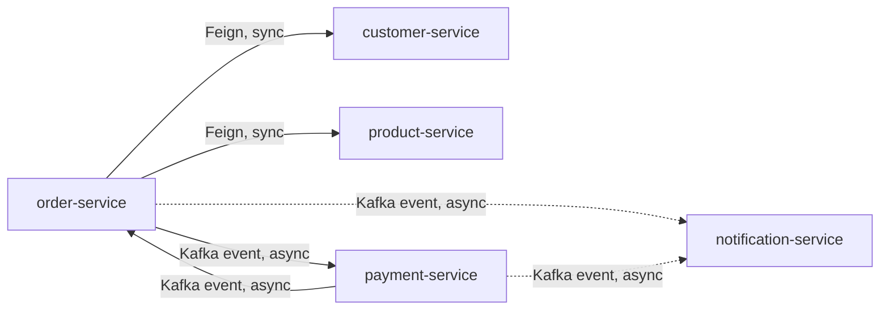

# Intermediate · Lesson 01 — Microservices Architecture

## Goal

Understand *why* the Order Management System is split into multiple services
instead of one Spring Boot monolith, and what that costs you.

## From monolith to microservices

In the Beginner module, `customer-service` and `product-service` were
independent, but nothing forced them to talk to each other. A real order
needs to:

1. Verify the customer exists.
2. Check product availability and price.
3. Reserve stock.
4. Record the order.
5. Take payment.
6. Notify the customer.

A monolith would do all of this in one process with local method calls
wrapped in one database transaction — simple, but it doesn't scale
independently, can't be deployed independently, and a bug in "notifications"
can crash "checkout."

This course splits that flow across **five** services:

* **Synchronous** (OpenFeign, this module): used where `order-service` needs an
  immediate answer to decide what to do next — "does this customer exist?",
  "is there enough stock?"
* **Asynchronous** (Kafka events, Advanced module): used where the caller
  doesn't need to block — `order-service` doesn't wait around for payment to
  clear; it fires an event and moves on.

## The concerns this module adds

Splitting into services introduces problems a monolith doesn't have, and each
remaining Intermediate lesson solves exactly one:

| Problem | Solved by | Lesson |
|---|---|---|
| "Where *is* customer-service right now? What port? What host?" | Service discovery | [02](02-service-discovery-eureka.md) |
| "I don't want clients to know about 5 different hosts/ports" | API Gateway | [03](03-api-gateway.md) |
| "How does order-service *call* customer-service in code?" | OpenFeign | [04](04-openfeign-inter-service-communication.md) |
| "customer-service is down/slow — don't let it take order-service down too" | Resilience4j | [05](05-resilience4j.md) |

## Database per service

Notice each service owns its **own** database (`customerdb`, `productdb`,
`orderdb`, `paymentdb` — all separate H2 instances). This is deliberate:
services must not share tables, or you've just built a distributed monolith
with extra network hops. Each service is the sole owner and gatekeeper of its
own data; everyone else asks through its API.

The cost: you can no longer run one SQL `JOIN` across an order and its
customer. `order-service` instead calls `customer-service` over HTTP
(Lesson 04) or, for eventual-consistency use cases, listens to events
(Advanced module).

## Try it yourself

Sketch (on paper or in a `.md` file) what a "cancel order" flow would need to
touch across these five services, and whether each step should be
synchronous or asynchronous. Compare your answer after finishing the Advanced
module's Saga lesson.

## Key takeaways

* Microservices trade local method calls + one transaction for network calls + eventual consistency, in exchange for independent scalability/deployability.
* Each service owns its own database — no cross-service SQL joins.
* Use synchronous calls (Feign) when you need an immediate answer; asynchronous events (Kafka) when you don't.

Next: [Lesson 02 — Service Discovery with Eureka](02-service-discovery-eureka.md)
