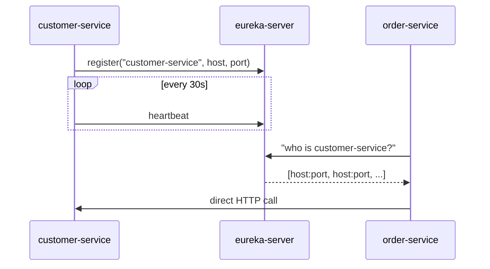

# Intermediate · Lesson 02 — Service Discovery with Eureka

## Goal

Understand why hardcoding hostnames/ports doesn't work for microservices, and
how Netflix Eureka solves it.

## The problem

In a containerized/cloud environment, a service instance's IP address and
port are assigned dynamically, instances scale up/down, and unhealthy
instances need to be removed automatically. Hardcoding
`http://192.168.1.42:8081` into `order-service`'s config would break the
moment `customer-service` restarts on a different host.

## The registry pattern



Every service **registers itself** with Eureka on startup and sends periodic
heartbeats. Any service that wants to call another asks Eureka for the
current list of healthy instances (this happens transparently, as you'll see
in Lesson 04).

## The registry server

```java
@SpringBootApplication
@EnableEurekaServer
public class EurekaServerApplication {
    public static void main(String[] args) {
        SpringApplication.run(EurekaServerApplication.class, args);
    }
}
```

See [`EurekaServerApplication.java`](../../order-management-system/eureka-server/src/main/java/com/training/oms/eureka/EurekaServerApplication.java)
and its [`application.yml`](../../order-management-system/eureka-server/src/main/resources/application.yml):

```yaml
eureka:
  client:
    register-with-eureka: false   # this node IS the registry
    fetch-registry: false
```

## Every other service is a client

```java
@SpringBootApplication
@EnableDiscoveryClient
public class OrderServiceApplication { ... }
```

Plus, in each service's `application.yml`:

```yaml
eureka:
  client:
    service-url:
      defaultZone: http://localhost:8761/eureka/
  instance:
    prefer-ip-address: true
spring:
  application:
    name: order-service   # <-- this is the name other services discover you by
```

`spring.application.name` is the **service ID** every other service will use
to find this one — you'll see this exact string again as the `name` attribute
on `@FeignClient` in Lesson 04.

## Run it

```bash
cd order-management-system/eureka-server && mvn spring-boot:run
```

Open http://localhost:8761 in a browser — the Eureka dashboard. Now start
`customer-service` and refresh; you'll see it appear in the registry within
~30 seconds (the default heartbeat/registration interval).

## Try it yourself

Start two instances of `customer-service` on different ports
(`mvn spring-boot:run -Dspring-boot.run.arguments=--server.port=8181`) and
watch the Eureka dashboard show two instances under the same
`CUSTOMER-SERVICE` application. This is exactly what enables the
client-side load balancing you'll see the API Gateway and Feign perform
automatically in the next two lessons.

## Key takeaways

* Services register themselves with Eureka by `spring.application.name`, not by hostname/port.
* Callers ask Eureka "who is `X`?" instead of hardcoding a URL — this is what makes `lb://` (Lesson 03) and `@FeignClient(name = "...")` (Lesson 04) work.
* `register-with-eureka: false` / `fetch-registry: false` mark the registry server itself as not a client of itself.

Next: [Lesson 03 — API Gateway](03-api-gateway.md)
