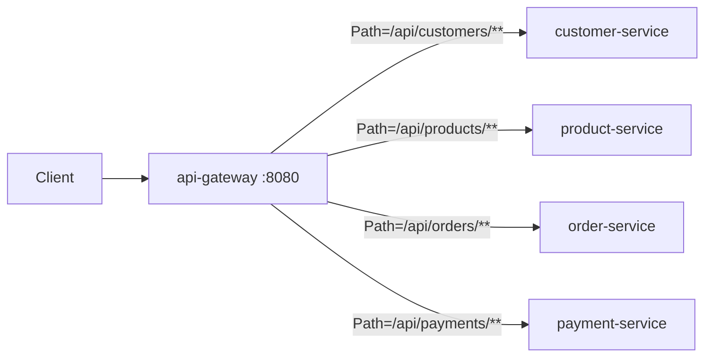

# Intermediate · Lesson 03 — API Gateway

## Goal

Understand why clients shouldn't talk to five different services directly,
and how Spring Cloud Gateway provides a single, load-balanced entry point.

## Why a gateway?

Without a gateway, a browser/mobile client would need to know:

* Five different hostnames/ports.
* Which service owns which URL path.
* How to attach auth tokens to five different services individually.
* How to handle five services' worth of CORS configuration.

An **API Gateway** is a reverse proxy that sits in front of everything:



Clients only ever know about `api-gateway:8080`. This lesson covers routing;
[Advanced Lesson 03](../advanced/03-security-jwt.md) covers the JWT
authentication filter that also lives here.

## Route configuration

See [`api-gateway/src/main/resources/application.yml`](../../order-management-system/api-gateway/src/main/resources/application.yml):

```yaml
spring:
  cloud:
    gateway:
      routes:
        - id: customer-service
          uri: lb://customer-service
          predicates:
            - Path=/api/customers/**
        - id: order-service
          uri: lb://order-service
          predicates:
            - Path=/api/orders/**
```

* `predicates: Path=/api/customers/**` — match any request whose path starts with `/api/customers/`.
* `uri: lb://customer-service` — the `lb://` scheme means "**l**oad-**b**alance across whatever Eureka instances are registered under this name," not a literal hostname. This is the exact same discovery mechanism from Lesson 02, applied to gateway routing instead of a Feign client.

The gateway is itself `@EnableDiscoveryClient` (implicitly, via
`spring-cloud-starter-netflix-eureka-client`), so it can resolve `lb://` URIs
by asking Eureka.

## Run the full routed stack

```bash
# terminal 1-3
cd eureka-server && mvn spring-boot:run
cd customer-service && mvn spring-boot:run
cd api-gateway && mvn spring-boot:run
```

```bash
curl http://localhost:8080/api/customers          # -> routed to customer-service:8081
```

Same request, one hostname (`:8080`), regardless of how many
`customer-service` instances exist or what ports they're on.

## Try it yourself

Add a new route for a hypothetical `inventory-service` on path
`/api/inventory/**`, then remove it again — this is exactly the process
you'd follow to onboard a new microservice into this system without touching
any existing service.

## Key takeaways

* An API Gateway is the single public entry point; internal service names/ports become an implementation detail.
* `lb://service-name` load-balances across Eureka-registered instances — Spring Cloud Gateway resolves this the same way `@FeignClient` does (next lesson).
* Cross-cutting concerns (auth, rate limiting, logging) belong at the gateway, not duplicated in every service — see [Advanced Lesson 03](../advanced/03-security-jwt.md).

Next: [Lesson 04 — Inter-Service Communication with OpenFeign](04-openfeign-inter-service-communication.md)
