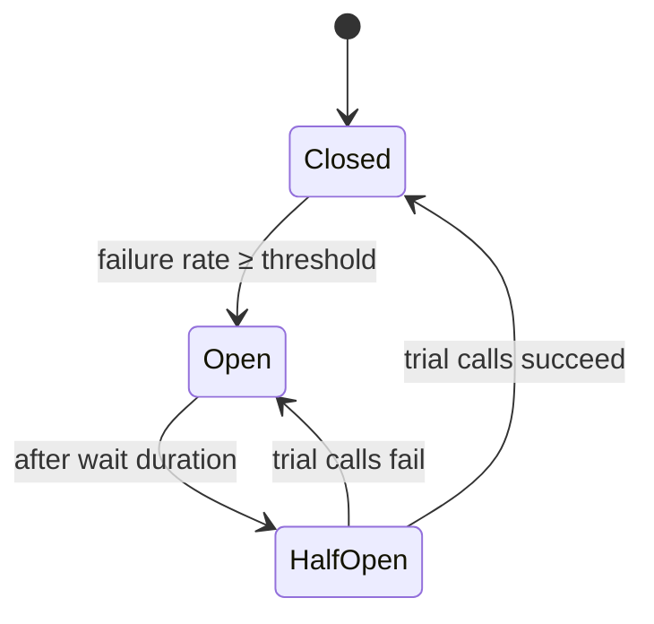

# Intermediate · Lesson 05 — Resilience4j: Circuit Breaker & Retry

## Goal

Stop a slow/failing downstream service from cascading into an outage of the
caller, using Resilience4j annotations around the Feign calls from Lesson 04.

## The cascading failure problem

If `customer-service` goes down, every request to `order-service` that needs
a customer lookup will hang for the full Feign timeout (2s), then fail. Under
load, that ties up `order-service`'s threads faster than they free up —
`order-service` goes down too, even though its own code is fine. A **circuit
breaker** detects the failure rate and starts failing fast instead, giving
the downstream service room to recover and protecting the caller's own
capacity.



## The self-invocation pitfall

Resilience4j's `@CircuitBreaker`/`@Retry` are implemented as **Spring AOP**
advice — a proxy wraps the bean and intercepts the annotated method call.
That interception **only happens when the call comes from outside the bean**
(`otherBean.method()`). If `OrderService` called
`this.getCustomerWithCircuitBreaker(...)` on itself, the proxy would be
bypassed entirely and the annotation would silently do nothing.

That's why the guarded calls live in their own beans,
[`CustomerGateway`](../../order-management-system/order-service/src/main/java/com/training/oms/order/client/CustomerGateway.java)
and
[`ProductGateway`](../../order-management-system/order-service/src/main/java/com/training/oms/order/client/ProductGateway.java) —
`OrderService` calls `customerGateway.getCustomer(...)`, a genuine
cross-bean call, so the proxy intercepts it correctly.

## Circuit breaker + retry together

```java
@Retry(name = "customerService")
@CircuitBreaker(name = "customerService", fallbackMethod = "fallback")
public CustomerDto getCustomer(Long customerId) {
    return customerClient.getCustomer(customerId);
}

private CustomerDto fallback(Long customerId, Throwable throwable) {
    throw new DownstreamServiceException("customer-service is currently unavailable", throwable);
}
```

See [`CustomerGateway.java`](../../order-management-system/order-service/src/main/java/com/training/oms/order/client/CustomerGateway.java).

* `@Retry` runs first (innermost is applied last, so annotation order matters: `@Retry` wraps the raw call, `@CircuitBreaker` wraps the retrying call) — a single transient blip gets retried automatically before the circuit breaker ever sees a failure.
* The **fallback method** must have the same parameters as the guarded method plus a trailing `Throwable`, and the same return type. It runs when the circuit is open or all retries are exhausted.
* Here the fallback simply throws a clear `DownstreamServiceException`, mapped to `503 Service Unavailable` by
  [`GlobalExceptionHandler`](../../order-management-system/order-service/src/main/java/com/training/oms/order/exception/GlobalExceptionHandler.java) —
  a **fail-fast fallback**. In other systems, a fallback might instead return cached/default data — a **fail-soft fallback**. Choose based on whether stale data is safe for your use case.

## Configuration

```yaml
resilience4j:
  circuitbreaker:
    instances:
      customerService:
        sliding-window-size: 10
        minimum-number-of-calls: 5
        failure-rate-threshold: 50
        wait-duration-in-open-state: 10s
  retry:
    instances:
      customerService:
        max-attempts: 3
        wait-duration: 300ms
```

See [`order-service/application.yml`](../../order-management-system/order-service/src/main/resources/application.yml).
Out of the last 10 calls (once at least 5 have happened), if 50%+ failed, the
circuit opens for 10 seconds, then allows a few trial calls through
(half-open) before deciding whether to close again.

## Observe it

```yaml
management:
  endpoints:
    web:
      exposure:
        include: health,info,metrics,circuitbreakers
```

```bash
curl http://localhost:8083/actuator/health   # includes a "customerService" CircuitBreaker component
```

## Try it yourself

1. Stop `customer-service`.
2. Send several `POST /api/orders` requests through `order-service` in a loop.
3. Watch `/actuator/health` — after ~5 calls, the circuit breaker for `customerService` should flip to `OPEN`, and subsequent calls fail immediately (no more 2-second waits) until the wait duration elapses.

## Key takeaways

* Circuit breakers fail fast once a downstream dependency is clearly unhealthy, protecting the caller's own thread/connection capacity.
* Put `@CircuitBreaker`/`@Retry` on a **separate bean**, never called via `this.` — otherwise Spring AOP silently skips it.
* Fallback methods must match signature + trailing `Throwable`; decide deliberately between fail-fast and fail-soft.

You've completed the resilience patterns for this module. Continue to
[Lesson 06 — API Documentation with OpenAPI & Swagger UI](06-api-documentation-openapi-swagger.md)
before moving on to the **Advanced** module.
